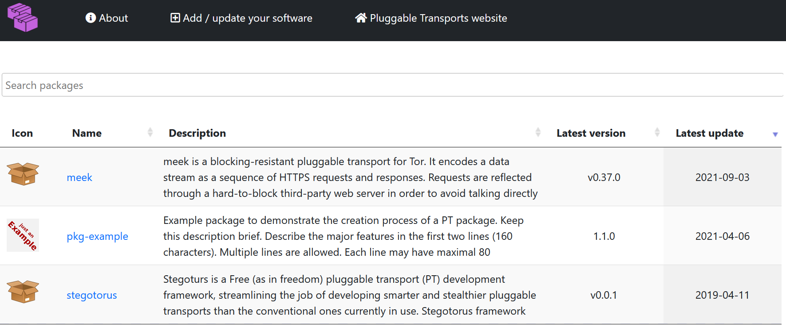

# Pluggable Transports Software Repository

> <https://software.pluggabletransports.info/>

A list of available Pluggable Transports packages, libraries and
implementations.

- [**Learn how to add PT related software here**](CONTRIBUTING.md)

- [**Info on how to build this website**](doc/development.md)

## Credits

This project is based on the
[GNU Octave package index](https://github.com/gnu-octave/packages)
